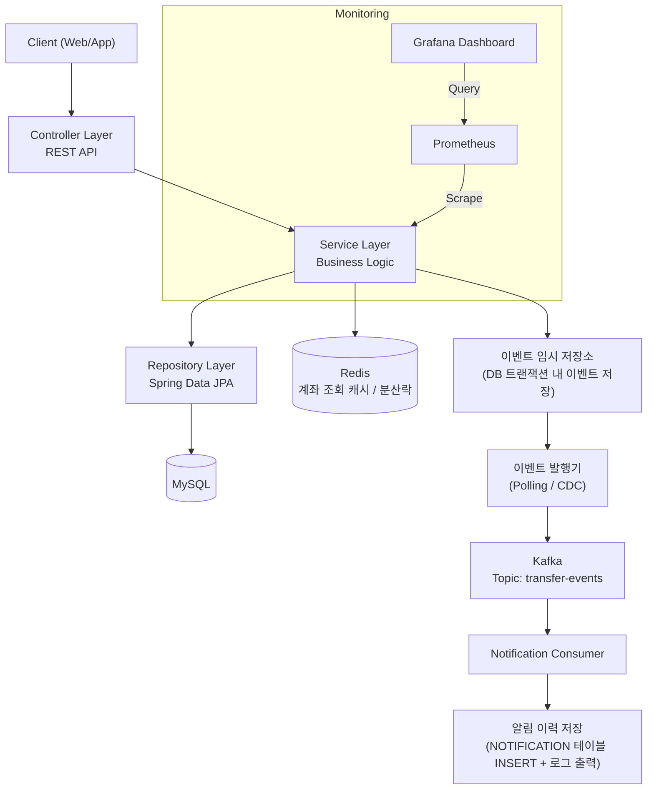

# banking-transfer-system
> 인터넷 뱅킹 송금 서비스를 설계하고 구현하는 백엔드 프로젝트

# Project Overview
> 실제 인터넷 뱅킹의 송금 프로세스를 기반으로 금융 도메인을 학습하고, 단순 CRUD를 넘어 데이터 정합성, 동시성 제어, 이벤트 기반 처리를 고려한 백엔드 시스템을 구현하는 것을 목표로 합니다.

# Goals
- 송금 시스템 구현
- 데이터 정합성 보장
- 동시성 문제 해결
- 이벤트 기반 아키텍처 적용
- 운영 환경 및 성능 테스트 경험

---

# Features

## Member
- 회원가입
- 로그인
- 회원 정보 조회

## Account
- 계좌 개설
- 계좌 조회
- 계좌 목록 조회
- 계좌 잠금 / 해제

## Banking
- 입급
- 출금
- 계좌 간 송금
- 송금 한도 검증
- 잔액 검증

## Transaction
- 거래내역 조회
- 거래 상세 조회
- 거래 유형별 조회

## Notification
- 송금 완료 알림
- 입금 완료 알림

---

# Tech Stack

| Category | Stack |
|-----------|-------|
| Language | Java 21 |
| Framework | Spring Boot |
| Database | MySQL |
| Cache | Redis |
| Message Broker | Kafka |
| ORM | Spring Data JPA |
| Build Tool | Gradle |
| Infra | Docker |

---

# Architecture

## 전체 구조

## 전체 구조

## 동시성 제어 - Redis 분산락
여러 요청이 동시에 같은 계좌를 처리하려고 할 때, 잔액이 잘못 반영되는 문제를 막기 위해 **Redis 기반 분산락**을 적용
**동작 방식**
1. 계좌 처리를 시작하기 전 락을 시도합니다. 이미 다른 요청이 해당 계좌를 처리 중이라면 락 획득에 실패하고 대기 후 재시도 합니다.
2. 락을 획득한 요청만 잔액 검증 -> 출금 -> 입금 -> DB 커밋까지 순차적으로 처리합니다.
3. 처리가 끝나면 락을 해제하는데 이때 단순 삭제가 아니라 자신이 획득한 락이 맞는지 확인 후 삭제합니다.
4. 처리 중 서버 장애가 발생해도 락이 영구히 잠기지 않도록 일정 시간 후 자동 해제되는 안전장치를 둡니다. (자동 만료 TTL)

이 방식으로 동일 계좌에 대한 동시 요청을 순차적으로 처리하여 잔액 정합성을 보장합니다.

## 이벤트 기반 알림 처리 - 이벤트 임시 저장소 패턴

송금 처리와 알림 발송을 곧바로 연결하면 송금은 성공했지만 알림 발송에 실패하는(또는 그 반대의) **정합성 문제**가 발생할 수 있습니다. 이를 해결하기 위해 이벤트 임시 저장소를 도입합니다.
**처리 흐름**
1. 계좌 잔액을 변경하는 것과 동시에 "알림을 발행해야 한다"는 이벤트 기록을 같은 DB 트랜잭션 안에서 함께 저장합니다. 둘 중 하나만 성공하는 경우가 없도록 원자성을 보장합니다.
2. 별도의 스케줄러가 일정 주기로 아직 발행되지 않은 이벤트를 조회하여 kafka로 전송합니다.
3. Notification Consumer가 Kafka 이벤트를 구독하여 알림 데이터를 저장하고 처리합니다.
4. 메시지 브로커의 특성상 동일 이벤트가 중복 전달될 수 있어 이벤트 식별자를 기준으로 중복 처리를 방지하는 멱등성 로직을 적용합니다.

이 구조를 통해 "송금 처리"와 "알림 발송"의 책임을 분리하면서도, 알림 누락 없이 안정적으로 이벤트를 전달할 수 있습니다.